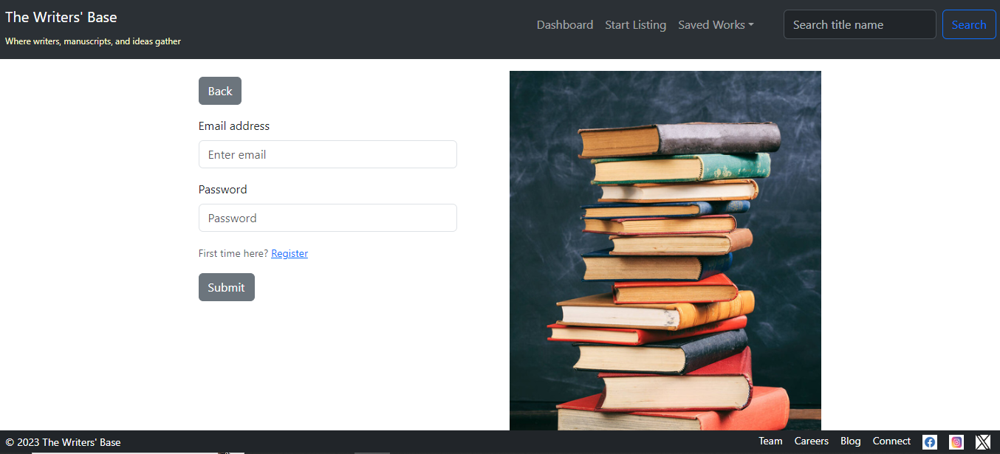
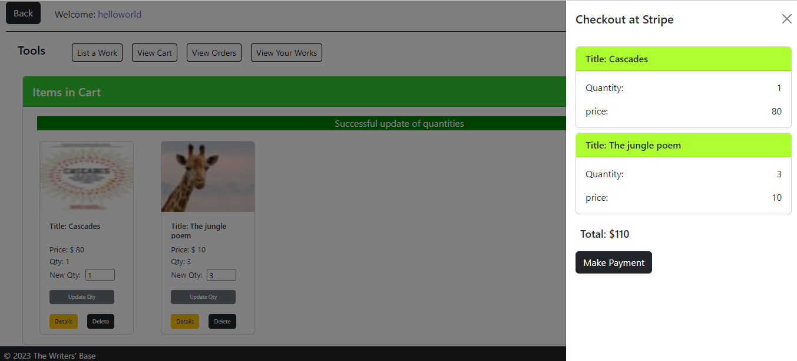
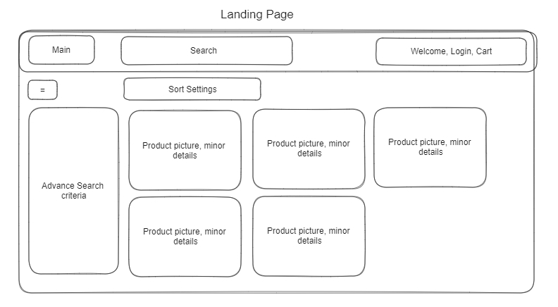

<h2> Project Three Documentation – E-commerce Web Application </h2>

This is Project Three of Trent Global’s Full Stack web application development course, conducted at week 20.

<h4> Project Introduction </h4>

The task is to create a user-friendly e-commerce website for a shop owner to list their products on the webpage. This project will take on the task of bringing e-commerce capabilities to the literary industry, providing an alternative to the region constrained Amazon KDP, allowing indie writers to list their literary works for sale – be it books, web novels, short stories, poems, or manuscripts.

Frontend React Live link of this project can be found: <a href="https://singular-jalebi-389fbc.netlify.app/#/"> Here </a> 
Backend codes of this project can be found in this repo: <a href="https://github.com/Kern000/project-three-backend"> Here </a>

<h4> Front End Design </h4>

Page theme features a neat interface for shoppers and users to comfortably enjoy navigation. The color theme is an off-black with white theme for a classy feeling which transits into brighter and exciting colors when navigating within the shopping cart and orders.

<h5> Landing Page </h5>

 

<h5> Search Bar </h5>

 

 
<h5> Found products </h5>

 

 
<h5> Product Details </h5>

 

<h5> Add to cart </h5>

 

<h5> Login </h5>

 

<h5> Registration </h5>

 

<h5> Dashboard (with user uploaded products) </h5>

 

<h5> Dashboard at empty cart </h5>

 

<h5> Dashboard checkout </h5>

 

<h5> External stripe so that our site do not hold credit card information </h5>

 

<h5> Payment confirmation (With Animation) </h5>

 

 
<h5> View only paid orders here </h5>

 

<h5> User can add product or update their product </h5>

 

<h5> For Admin Users – Server side resources are generated </h5>

 

<h5> Admin Handle all users’ products – with full search capabilities and hiding of search box </h5>

 

<h5> Admin Handle users </h5>

 

 
<h5> Admin Manage Carts </h5>

 

<h5> And lastly, Admin manage Orders </h5>

 

 
<h4> ------- Value proposition ------- </h4>

This website provides a lightweight alternative to Amazon KDP for listing literary works in less rigid formats, unconstrained by kindle formats. Users may also use this page to redirect traffic to their Amazon KDP page for those who find the low barrier printing capabilities of Amazon appealing.

The indie focus of this page would provide better visibility for indie writers compared to an oversaturated and commercialized marketplace like Amazon. Writers may also use this platform to list their works for reading and critique rather than for sale.

In three and a half weeks, this solo project presents a wide range of capabilities for a reader, a content creator, and the admin user managing the systems.

<h4> ------- Strategy ------- </h4>

Currently, there is no literary playground for indie writers to post their web novels and literary manuscripts in most countries. There is a clear gap in market here. Think of it as Pivix for writers.

<h4> ------ Target Audience ----- </h4>

This platform will be appealing to indie writers, editors looking for manuscripts, as well as readers looking for fresh content.

<h4> ------- User Story (Agile) ------- </h4>

<h5> Shopper: </h5>

“As a shopper, I want to come to the website and immediately be show relevant products. On the same page, without navigating away, it would be convenient for me to search for products, filter products based on my needs, look at product details, and add items to cart. After which, I need to be able to update my cart, update quantities, and delete unwanted products. I should then be able to check out and make payment, receive notification on payment success, and look at the order status of my orders. Lastly, I do not only want to access this website on a computer browser. I should be able to browse this website easily on my mobile phone as well. Thus, I am able to smoothly buy a product I want and be informed during the process.

<h5> Shop owner: </h5>

“As a store owner, I need an admin login in order to prevent unauthorized users from creating, updating, and deleting products. I should have a super account that allows me to create, update, and delete products. I should also be able to look at customer orders and check if the customer has made actual payment. I want to be able to notify customers when the order is processed.

<h5> Indie User: </h5>

“I want to be able to list my works in a simple intuitive manner and allow my fans to search for me and my works easily.”

<h4> ------- Features ------- </h4>

<h5> For shopper: </h5>

1.	Display ‘products’ and content on main page
2.	Search engine to look for ‘products’ and content on main page – via Restful API
3.	Filtering options to filter products on main page with custom controls
4.	Registration and login (authentication and authorization through JWT payloads)
5.	Profile page with Cart component to update and remove products from cart, as well as an order component to track orders
6.	Validation of input from frontend forms to reduce customer error
7.	Success notification on payment – future implementation of email notification of order
8.	Back to other page shortcuts – seamless and intuitive transition from page to page and between functions

<h5> For shop owner: </h5>

1.	Display all products listed
2.	Search engine for listed products
3.	Filtering options to filter products based on user and product
4.	Registration and login
5.	CSRF protection on forms
6.	User input in forms is validated
7.	Notifications are flashed based on in-page events
8.	Admin IP is tracked in sessions – future implementation of phone OTP for better security and 2FA.
9.	Orders made by users saved in database, created once customers make payment, admin user able to search for orders
10.	Update order status (paid, set to unpaid or incomplete), update orders, add orders, delete orders
11.	Interface to manage users

<h4> -------- Navigational Flow ------- (frontend) </h4>

 

 
<h4> -------- Conceptual Design -------- </h4>

 

<h4> --------- Database Structure --------- </h4>

 

<h4> ------- Design ------- </h4>

Frontend products: A scheme of classy white and off-black.
User dashboard: A scheme of light colors is used for vibrant and welcoming feeling.
Admin dashboard: muted and pale colors for ease on eyes for long usage.

<h4> ------- Technology stack used -------- </h4>

React functional programming hooks, React-dotenv, Stripe React, axios, Express, Db-migrate, bookshelf model with knex methods, MySQL/Postgres, Stripe, Cloudinary Image upload and sanitization, Caolan forms, sessions, JWT Authentication, regex validation.

<h4> ------- Testing ------- </h4>
Resolved errors in caught in development, deployment, and user testing.
Test case: Typing of <> characters and certain special characters used in scripting in frontend forms
Expected: invalid characters in “targeted” form field
 

 Frontend validation with regex and server validation using models secures the front end and backend. 

<h4> ------- Limitations and Future Enhancements ------- </h4>
1.	Users can save their favorite works from other users.
2.	Email notification on payment for orders.
3.	Admin user 2FA authentication with OTP.

<h4> ------- Deployment ------- </h4>
Hosting of frontend on Netlify, hosting of server and database on Render.

<h4> ------- Credits ------- </h4>
A special thanks to Paul for his comprehensive and up-to-date teaching, Alex for the workspace accommodations, and Yong Sheng for all the techniques on debugging that are used in the industry. This project could not have been completed without your support.
